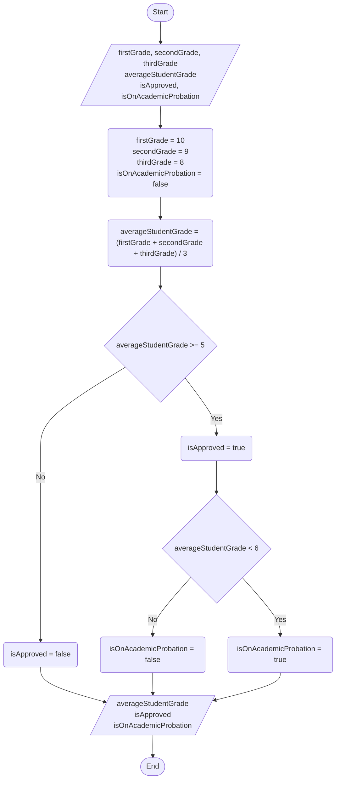

<div align="center">

  🇧🇷 **[Versão em Português](README.pt-BR.md)**
  <br>

  # ⚖️ Grade Approval & Decision Flow (`GradeApprovalFlow.ts`)

</div>

---

## 🎯 Problem Statement

Calculate the arithmetic average of three grades and determine the student's academic status through compound conditional logic:
- **Average < 5:** Failed (`isApproved = false`, `isOnAcademicProbation = false`).
- **5 <= Average < 6:** Academic Probation / Recovery (`isApproved = true`, `isOnAcademicProbation = true`).
- **Average >= 6:** Direct Approval (`isApproved = true`, `isOnAcademicProbation = false`).

---

## 📊 Flowchart (ISO / ANSI)



---

## 🧪 Desk Checking (RAM Memory Trace)

A manual simulation tracking the state of each variable in RAM step-by-step to prevent logical errors:

| Execution Step | `firstGrade` | `secondGrade` | `thirdGrade` | `averageStudentGrade` | `isApproved` | `isOnAcademicProbation` |
| :--- | :--- | :--- | :--- | :--- | :--- | :--- |
| **Variable Declaration** | `undefined` | `undefined` | `undefined` | `undefined` | `undefined` | `undefined` |
| **Initialization & Input** | `10` | `9` | `8` | `undefined` | `undefined` | `false` |
| **Arithmetic Processing** | `10` | `9` | `8` | `9.0` | `undefined` | `false` |
| **Condition 1 (`>= 5`)** | `10` | `9` | `8` | `9.0` | `true` | `false` |
| **Condition 2 (`< 6`)** | `10` | `9` | `8` | `9.0` | `true` | `false` |

---

## 💻 Source Code

```typescript
// PROBLEM
// Calculate the arithmetic average of 3 exam grades and evaluate academic status:
// - Average < 5: Failed (isApproved = false, isOnAcademicProbation = false)
// - 5 <= Average < 6: Academic Probation / Recovery (isApproved = true, isOnAcademicProbation = true)
// - Average >= 6: Approved Direct (isApproved = true, isOnAcademicProbation = false)

let firstGrade: number;
let secondGrade: number;
let thirdGrade: number;
let averageStudentGrade: number;
let isApproved: boolean;
let isOnAcademicProbation: boolean;

firstGrade = 10;
secondGrade = 9;
thirdGrade = 8;
isOnAcademicProbation = false;

averageStudentGrade = (firstGrade + secondGrade + thirdGrade) / 3;

if (averageStudentGrade >= 5) {
    isApproved = true;

    if (averageStudentGrade < 6) {
        isOnAcademicProbation = true;
    } else {
        isOnAcademicProbation = false;
    }
} else {
    isApproved = false;
}

console.log("Average:", averageStudentGrade);
console.log("Approved:", isApproved);
console.log("On Probation:", isOnAcademicProbation);
```

---

## 🖥️ Terminal Output

```text
Average: 9
Approved: true
On Probation: false
```

---

## 💡 Key Concepts Applied

- **Conditional Branching (`if` / `else`):** Directing algorithm execution flow according to boolean truth expressions.
- **Nested Decision Diamonds:** Modeling multi-tier decisions in ISO/ANSI standard flowcharts (`>= 5` branch leading to `< 6` check).
- **Desk Checking / RAM Tracing:** Manually verifying variable state transitions before code deployment.
- **Clean Code Boolean Naming:** Using prefix verbs (`isApproved`, `isOnAcademicProbation`) to communicate boolean semantics instantly.
- **Direct Boolean Assignment:** For simple two-way branches (e.g. `isApproved = average >= 6`), direct comparison assignment eliminates boilerplate `if / else` blocks.

---

## 🚀 How to Run

```bash
# Direct execution via tsx
npx tsx src/05-grade-approval-flow/GradeApprovalFlow.ts
```
