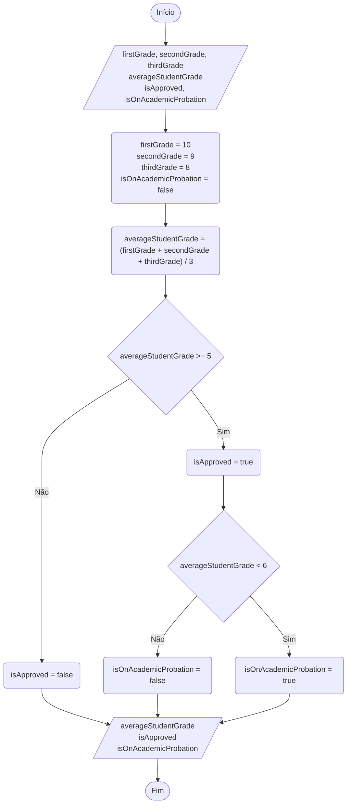

<div align="center">

  🇺🇸 **[English Version](README.md)**
  <br>

  # ⚖️ Aprovação de Notas & Fluxo Decisório (`GradeApprovalFlow.ts`)

</div>

---

## 🎯 Enunciado do Problema

Calcular a média aritmética de três notas e determinar a situação acadêmica do aluno utilizando estruturas condicionais compostas:
- **Média < 5:** Reprovado (`isApproved = false`, `isOnAcademicProbation = false`).
- **5 <= Média < 6:** Recuperação / Avaliação Especial (`isApproved = true`, `isOnAcademicProbation = true`).
- **Média >= 6:** Aprovado Direto (`isApproved = true`, `isOnAcademicProbation = false`).

---

## 📊 Fluxograma (Norma ISO / ANSI)



---

## 🧪 Teste de Mesa (Rastreamento na Memória RAM)

Simulação manual passo a passo do estado das variáveis na memória RAM para verificação do algoritmo antes da execução:

| Momento da Execução | `firstGrade` | `secondGrade` | `thirdGrade` | `averageStudentGrade` | `isApproved` | `isOnAcademicProbation` |
| :--- | :--- | :--- | :--- | :--- | :--- | :--- |
| **Declaração** | `undefined` | `undefined` | `undefined` | `undefined` | `undefined` | `undefined` |
| **Inicialização e Entrada** | `10` | `9` | `8` | `undefined` | `undefined` | `false` |
| **Processamento Aritmético** | `10` | `9` | `8` | `9.0` | `undefined` | `false` |
| **Condicional 1 (`>= 5`)** | `10` | `9` | `8` | `9.0` | `true` | `false` |
| **Condicional 2 (`< 6`)** | `10` | `9` | `8` | `9.0` | `true` | `false` |

---

## 💻 Código Fonte

```typescript
// PROBLEM
// Calculate the arithmetic average of 3 exam grades and evaluate academic status:
// - Average < 5: Failed (isApproved = false, isOnAcademicProbation = false)
// - 5 <= Average < 6: Academic Probation / Recovery (isApproved = true, isOnAcademicProbation = true)
// - Average >= 6: Approved Direct (isApproved = true, isOnAcademicProbation = false)

let firstGrade: number;
let secondGrade: number;
let thirdGrade: number;
let averageStudentGrade: number;
let isApproved: boolean;
let isOnAcademicProbation: boolean;

firstGrade = 10;
secondGrade = 9;
thirdGrade = 8;
isOnAcademicProbation = false;

averageStudentGrade = (firstGrade + secondGrade + thirdGrade) / 3;

if (averageStudentGrade >= 5) {
    isApproved = true;

    if (averageStudentGrade < 6) {
        isOnAcademicProbation = true;
    } else {
        isOnAcademicProbation = false;
    }
} else {
    isApproved = false;
}

console.log("Average:", averageStudentGrade);
console.log("Approved:", isApproved);
console.log("On Probation:", isOnAcademicProbation);
```

---

## 🖥️ Saída no Terminal

```text
Average: 9
Approved: true
On Probation: false
```

---

## 💡 Conceitos Principais Aplicados

- **Desvios Condicionais (`if` / `else`):** Controle do fluxo de execução com base no resultado booleano de expressões lógicas.
- **Modelagem Visual com Losangos:** Representação formal de tomadas de decisão na norma ISO/ANSI (`>= 5` e posterior verificação `< 6`).
- **Teste de Mesa e Depuração:** Rastreamento do ciclo de vida das variáveis na RAM para localização preventiva de bugs.
- **Clean Code em Nomenclaturas Booleanas:** Utilização de prefixos verbais semânticos (`isApproved`, `isOnAcademicProbation`).
- **Atribuição Booleana Direta:** Para condicionais binárias simples (como `isApproved = average >= 6`), a atribuição direta do resultado da comparação elimina blocos `if / else` redundantes.

---

## 🚀 Como Executar

```bash
# Execução direta via tsx
npx tsx src/05-grade-approval-flow/GradeApprovalFlow.ts
```
